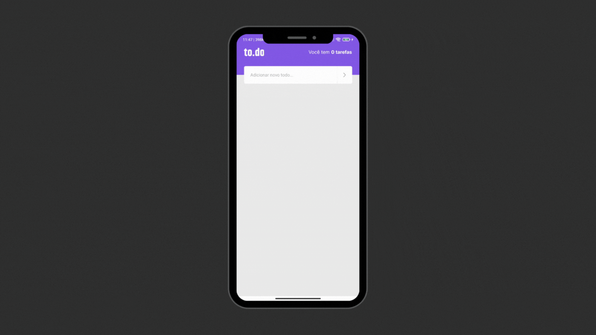

<h1 align="center">
    <br>
    :fire: Ignite - To.do App 
</h1>

<p align="center">
  

  

  

  <a href="https://github.com/gbdsantos/react-native-rocketseat-ignite-challenge-1-todos/commits/master">
    
  </a>

  
</p>

<h4 align="center">
  
  Um aplicativo simples de lista de tarefas
</h4>

<div align="center">
  <h4 align="center">Leia nos idiomas</h4>
  <a href="https://github.com/gbdsantos/react-native-rocketseat-ignite-challenge-1-todos">:us:
  </a>
</div>
</p>

## :bulb: About 

Desafio 01/02 do bootcamp **Ignite 2021** da trilha de **React Native**.

<br />

## :gear: Iniciando

```Bash
# 1. Instalar dependências
yarn install

# 2. Executar metro-bundler
yarn start

# 3. Executar app
yarn <android - ios>
```

## :memo: Liceneça
Este projeto está sob a licença do MIT. Veja em [LICENSE](https://github.com/gbdsantos/react-native-rocketseat-ignite-challenge-1-todos/blob/master/LICENSE) para mais informações.

---
Feito com ♥ by :man_astronaut: Guilherme Bezerra :wave: [Entrar em contato!](https://www.linkedin.com/in/gbdsantos/)
