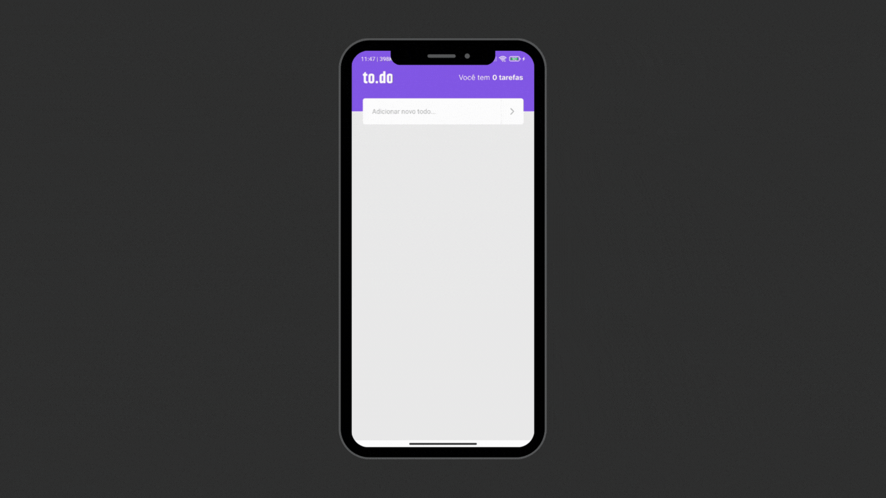

<h1 align="center">
    <br>
    :fire: Ignite - To.do App 
</h1>

<p align="center">
  

  

  

  <a href="https://github.com/gbdsantos/react-native-rocketseat-ignite-challenge-1-todos/commits/master">
    
  </a>

  
</p>

<h4 align="center">
  
  A simple To-do list app
</h4>

<div align="center">
  <h4 align="center">Read on Languages</h4>
  <a href="https://github.com/gbdsantos/react-native-rocketseat-ignite-challenge-1-todos/blob/master/README-PT-BR.md">:brazil:
  </a>
</div>
</p>

## :bulb: About 

**Ignite 2021** bootcamp challenge code 01/02 from **React Native** trail.

<br />

## :gear: Getting Start

```Bash
# 1. Install dependencies
yarn install

# 2. Run metro-bundler
yarn start

# 3. Run app
yarn <android - ios>
```

## :memo: License
This project is under the MIT license. See the [LICENSE](https://github.com/gbdsantos/react-native-rocketseat-ignite-challenge-1-todos/blob/master/LICENSE) for more information.

---
Made with ♥ by :man_astronaut: Guilherme Bezerra :wave: [Get in touch!](https://www.linkedin.com/in/gbdsantos/)
